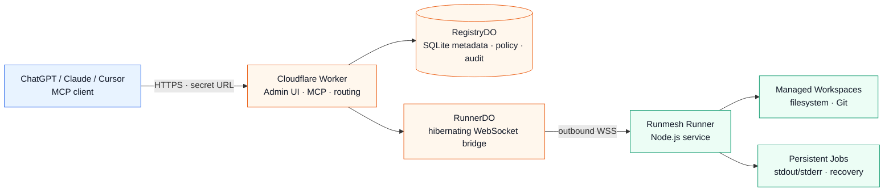

<p align="center">
  
</p>

<p align="center">
  <strong>Agent Control Plane for remote coding runtimes</strong>
</p>

<p align="center">
  Model-neutral · client-neutral · outbound-only
</p>

<p align="center">
  English · <a href="./README.zh-CN.md">简体中文</a>
</p>

<p align="center">
  <a href="https://github.com/aloneio/runmesh/actions/workflows/ci.yml?query=branch%3Adev"></a>
  <a href="https://developers.cloudflare.com/workers/"> </a>
  <a href="https://nodejs.org/"> </a>
  <a href="./LICENSE"></a>
</p>

<p align="center">
  <a href="#quick-start">Quick Start</a> ·
  <a href="#architecture">Architecture</a> ·
  <a href="#mcp-tools">MCP Tools</a> ·
  <a href="./docs/security.md">Security</a> ·
  <a href="./docs/deployment.md">Deployment</a>
</p>

> [!IMPORTANT]
> Runmesh is **source-available under the PolyForm Noncommercial License 1.0.0**, not an OSI-approved open-source license. Commercial use requires separate written authorization; see [COMMERCIAL_LICENSE.md](COMMERCIAL_LICENSE.md).

> [!WARNING]
> `shell` is a host-shell capability, not a sandbox. Commands can access files, network resources, environment variables, credentials, and processes available to the Runner service identity. Use a restricted VM or container for untrusted code, and do not give an administrator/root Runner more authority than necessary.

## Overview

Runmesh connects an MCP client to one or more machines without putting a public server, MCP endpoint, or model API on those machines:

- **Cloudflare Worker** is the only public control plane and MCP endpoint.
- **RegistryDO** stores authentication, Runner, Workspace, policy, selection, audit, and bounded Job metadata.
- **RunnerDO** holds one authenticated outbound WebSocket per Runner and forwards correlated RPCs; it never executes code.
- **Runner** is a local Node.js service that performs filesystem, Git, shell, and persistent Job work.

The MCP client performs reasoning. Runmesh does not call an AI/model service API. Closing a browser, chat, MCP request, or Runner WebSocket does not stop an already started persistent Job.

## Why Runmesh

| Capability | What it provides |
| :-- | :-- |
| **Central control plane** | One Worker URL for multiple Runners and Workspaces, with an authenticated administrator dashboard. |
| **Outbound-only Runner** | The local service initiates `wss://` connectivity; no public IPv4, inbound port, tunnel, SSH server, or reverse relay is required. |
| **Explicit Workspace policy** | Administrators define Workspace roots and permissions centrally. Policy changes require Runner validation and acknowledgement before becoming active. |
| **Compact MCP surface** | Nine stable tools for Runner selection, Workspace discovery, inspection, reading, editing, shell Jobs, and Job management. |
| **Persistent Jobs** | Long-running commands continue after request or WebSocket disconnect and expose bounded, UTF-8-safe output pages. |
| **Defense in depth** | Worker, Durable Object, and local Runner boundaries independently validate identity, policy revision, paths, permissions, and payload limits. |
| **Free-plan-oriented core** | The runtime uses Workers and SQLite-backed Durable Objects without requiring D1, R2, Queues, Sandbox, Containers, or a model provider. |

## Architecture



The Worker resolves the MCP client's sticky active Runner and checks effective permissions before forwarding a protected request. RunnerDO verifies the current Registry policy revision and connection generation. The local Runner checks the same policy again before touching the host.

## Quick Start

The normal path is **Panel-first**. Do not begin by exposing `ADMIN_TOKEN` or manually writing a Runner profile.

### 1. Install and validate locally

Requirements: Node.js 20+, npm, Git, Wrangler, and a Cloudflare account with SQLite-backed Durable Objects available.

```sh
git clone https://github.com/aloneio/runmesh.git
cd runmesh
npm ci
npm test
npm run typecheck
npm run build
npm run validate:worker
```

`npm run validate:worker` is a local Wrangler dry-run. It does not deploy, prove account quotas, or validate production edge logging.

### 2. Configure the control plane and deploy

Configure these server-side Wrangler secrets before deployment:

```sh
cd apps/worker
npx wrangler secret put ADMIN_TOKEN
npx wrangler secret put SETUP_TOKEN          # or SETUP_TOKEN_HASH
npx wrangler secret put RUNNER_TOKEN_PEPPER
npx wrangler secret put INTERNAL_CONTROL_SECRET
npx wrangler deploy --config wrangler.jsonc
```

`SETUP_TOKEN` (or its SHA-256 hexadecimal digest in `SETUP_TOKEN_HASH`) is required for first administrator setup. It is checked in constant time, consumed only as a setup credential, and never persisted as the administrator password. `ADMIN_TOKEN` is an advanced API credential for programmatic Runner administration; it is not the browser session, MCP credential, or Runner token.

### 3. Create the administrator account

Open the deployed root URL, for example `https://runmesh.example.com/`, and complete **Create administrator password** with the deployment setup token. First setup is atomic and first-success-wins. The password is stored as a salted PBKDF2-HMAC-SHA-256 verifier; browser sessions are opaque, HttpOnly, Secure, SameSite cookies.

### 4. Add and enroll a Runner

In **Admin → Runners**:

1. Create a Runner with a display name and optional safe Runner ID.
2. Copy the one-time enrollment code. It expires after 30 minutes and is invalidated by regeneration or successful redemption.
3. Run the generated Linux/macOS or Windows command from an elevated administrator/root shell.
4. Wait for the Runner to report online.

The bootstrap endpoint is intentionally credential-free and refuses to continue unless the operator has configured a stable distributable Runner package descriptor. The current bootstrap path requires Node.js 20+ and npm on the target host; it does not download a mutable GitHub branch or expose a long-lived credential in the Admin HTML.

Fresh enrollment creates a Runner with **zero Workspaces**. Re-enrollment replaces connection credentials and does not infer a Workspace from the current directory.

### 5. Add an approved Workspace

Open the Runner detail page and create an explicit managed Workspace. Select a permission profile such as **Read Only** or **Coding**, review the absolute root path, and wait for the Runner's policy acknowledgement.

Absolute Workspace roots are control-plane policy data sent privately to the selected Runner. They are visible only in the authenticated Admin Panel and are not returned to MCP clients, public endpoints, ordinary logs, or errors.

### 6. Create an MCP Client URL

In **Admin → MCP Clients**, create a client label and grant only the scopes it needs:

- `coding:read` — discovery, inspection, reading, and read-only Job queries;
- `coding:write` — transactional `edit`;
- `coding:exec` — `shell`, Job input, and Job cancellation.

Copy the generated URL immediately and configure it directly in the MCP client:

```text
https://runmesh.example.com/<one-time-secret>/mcp
```

The raw URL is shown only when the client is created or rotated. It is a path credential: do not place it in screenshots, source control, analytics, or chat transcripts. No OAuth callback or extra Bearer header is required for this self-hosted single-administrator flow.

### 7. Select a Runner

Use the MCP routing tools:

```text
runner_list()
runner_current()
runner_select({"runner_id":"home-pc"})
```

Selection is sticky per MCP Client, not per chat or request. Switching an already selected Runner requires explicit confirmation:

```text
runner_select({"runner_id":"office-pc","confirm_switch":true})
```

There is no automatic failover from a selected offline, stale, revoked, or unavailable Runner. Inspect `runner_current` and explicitly select another Runner when appropriate.

## MCP Tools

The default public catalog is intentionally small and stable:

| Tool | Scope | Purpose |
| :-- | :-- | :-- |
| `runner_list` | `coding:read` | List safe Runner IDs, display names, connection state, and availability. |
| `runner_current` | `coding:read` | Show this MCP Client's sticky Runner selection. |
| `runner_select` | `coding:read` | Select a Runner; switching requires `confirm_switch: true`. |
| `workspace_list` | `coding:read` | List readable Workspace IDs without exposing roots. |
| `inspect` | `coding:read` | Bounded `list`, `search`, `stat`, `git_status`, or `git_diff`. |
| `read` | `coding:read` | Read a workspace-relative file with UTF-8-safe pagination. |
| `edit` | `coding:write` | Apply a baseline-checked, transactional multi-file patch. |
| `shell` | `coding:exec` | Start a persistent host-shell Job through Bash or PowerShell. |
| `job` | mixed | List, inspect, paginate logs, send input, or cancel persistent Jobs. |

Runner RPC names such as `fs.*`, `exec.*`, `job.*`, `git.*`, and `env.*` remain private transport capabilities. They are not additional MCP tools and are not advertised by `tools/list`.

### Permission model

Effective access is the intersection of:

```text
MCP Client scopes
  ∩ per-Client × Runner restriction
  ∩ Runner policy
  ∩ Workspace policy
```

A restriction can only reduce access; it cannot grant a scope that the Client does not already have. `edit` implies `read`, and `shell` implies `read`, `edit`, and `job_control`. While a central policy is pending, rejected, invalid, offline-pending, or revision-mismatched, ordinary operations fail closed with a structured `policy_pending` or `permission_denied` result.

### Filesystem and inspect behavior

- Paths are Workspace-relative. Absolute, drive, UNC, device, NUL-byte, traversal, symlink-escape, and write-through-symlink paths are rejected.
- `read` and Job logs use bounded UTF-8-safe cursors so multibyte text can be reconstructed page by page without replacement characters.
- `edit` supports Add, Update, Delete, and Move patches with expected-hash/baseline checks, staging, atomic replacement where available, rollback, and bounded structured results.
- `inspect` is read-only and bounded by result count, bytes, depth, and operation timeout. It never returns local root paths.

### Shell and Jobs

`shell` always creates a persistent Job. `background: true` returns promptly; a foreground request waits only within the bounded local operation budget and returns a `job_id` when more work remains. The local foreground budget is 8 seconds and the Worker-to-Runner bridge budget is 12 seconds.

The Workspace identifies the initial working directory, policy, and audit context. It is not a shell root: a command may change directory and can access anything permitted to the Runner service identity. Use an external sandbox for untrusted execution.

Job metadata is redacted at the public boundary. RegistryDO retains bounded history for discovery while a selected Runner is offline; complete logs remain Runner-local and are paginated. Log quotas report `output_truncated: true` instead of growing without bound.

## Runner installation and service model

Runmesh is designed for a machine-level Runner independent of the invoking directory and `PATH`:

| Platform | Machine profile | Service direction |
| :-- | :-- | :-- |
| Linux | `/etc/remote-coding-runtime/profile.json` | system service with centralized install/config/state paths |
| macOS | `/Library/Application Support/RemoteCodingRunner/profile.json` | root-context LaunchDaemon layout |
| Windows | `C:\ProgramData\RemoteCodingRunner\profile.json` | elevated Scheduled Task adapter in the current implementation |

New machine installations default to a dedicated low-privilege service identity. `privileged_host` is an explicit administrator/root/SYSTEM opt-in requiring confirmation. Existing legacy profiles and `remote-coding-runtime` path names remain compatibility concerns and must be reviewed during migration; they are not silently treated as centrally authorized.

The Runner needs outbound network access only. Production connections require `wss://`; cleartext `ws://` is limited to explicit loopback development. `coding-runner doctor --json` provides structured required/optional diagnostics and returns a nonzero status when required checks fail.

The public bootstrap routes currently require an operator-configured `RUNNER_PACKAGE_SPEC` and a stable versioned package descriptor. This repository does not publish an npm package or GitHub Release automatically. Artifact download, signature verification, atomic version switching, health-checked rollback, and native cross-platform service acceptance remain release work rather than a promise of the current development deployment.

## Security and operations

### Credentials and authentication

- First setup requires both the deployment setup token and administrator password, with CSRF protection, throttling, and atomic first-success-wins initialization.
- MCP Client secrets contain at least 256 bits of entropy and are stored centrally only as verifiers. Unknown, invalid, and revoked secret paths are intentionally indistinguishable.
- Runner enrollment codes are short-lived, single-use, verifier-only records. Credential rotation/revocation closes the current socket and blocks old credentials.
- `revoke` preserves centrally managed Workspaces, policy history, Job history, client selections, and overrides. `reset runtime state` and permanent `delete` are separate operations; delete requires typed Runner-ID confirmation and removes Runner associations.
- Internal Worker-to-Durable-Object requests use versioned HMAC with method, full path/query, timestamp, nonce, and body digest. Replayed or expired requests are rejected.

### Policy lifecycle

A central policy is not active merely because an administrator saved it:

```text
Admin mutation
  → desired revision/checksum in RegistryDO
  → online Runner receives policy_update
  → Runner validates every Workspace using the service identity
  → Runner atomically persists and acknowledges the complete policy
  → Registry CAS-promotes the matching ACK to active
  → Worker authorizes the new revision
```

Invalid roots, incomplete Workspace status, checksum mismatches, stale ACKs, and out-of-order revisions preserve the previous active policy and fail closed. Existing Jobs continue unless an operator explicitly requests termination; tightening permissions blocks new incompatible operations.

### What Runmesh is not

Runmesh does not provide an operating-system sandbox, tenant isolation, automatic failover, inbound SSH, a public Runner HTTP server, a hosted IDE, billing, Teams/organizations, MCP Tasks, PTY/Web Terminal, browser automation, an AI agent, RAG, or a model gateway. Those capabilities are outside the current scope or require stronger infrastructure than a local policy boundary can provide.

## Architecture, protocol, and operations docs

- [Architecture](docs/architecture.md) — components, trust boundaries, and data flow.
- [Deployment](docs/deployment.md) — Worker secrets, dashboard setup, Runner enrollment, and migration cautions.
- [Security](docs/security.md) — threat model, credentials, host-shell risk, and policy enforcement.
- [Runner transport](docs/runner-transport.md) — outbound WebSocket, protocol versions, heartbeat, sync, and Jobs.
- [Protocol](docs/protocol.md) — typed wire messages, version negotiation, checksums, and limits.
- [Migration](docs/migration.md) — additive schema changes, legacy profiles, and rollback precautions.
- [ADR-0001](docs/adr-0001-architecture.md) — architecture decisions and non-goals.
- [SECURITY.md](SECURITY.md) — vulnerability reporting.
- [CONTRIBUTING.md](CONTRIBUTING.md) — contribution rules and development expectations.

## Development and validation

From the repository root:

```sh
npm ci
npm run typecheck
npm run test:unit
npm run test:e2e
npm run build
npm run validate:worker
npm run pack:smoke
npm run check:licenses
git diff --check
```

The validation suite is local evidence. It does not prove Cloudflare account quotas, production Durable Object migration/hibernation behavior, edge-log redaction, external Internet MCP-client compatibility, or native service installation on every operating system.

## License and acknowledgements

Runmesh is source-available under the [PolyForm Noncommercial License 1.0.0](LICENSE). It is **not** OSI-approved open-source software. Commercial use or additional rights require a separate written agreement; see [COMMERCIAL_LICENSE.md](COMMERCIAL_LICENSE.md).

The license change applies prospectively. The last Apache-licensed revision and exact historical Apache text are preserved in [LICENSE_HISTORY.md](LICENSE_HISTORY.md) and [LICENSES/Apache-2.0-history.txt](LICENSES/Apache-2.0-history.txt). See [THIRD_PARTY_NOTICES.md](THIRD_PARTY_NOTICES.md) for dependency boundaries, [TRADEMARKS.md](TRADEMARKS.md) for Runmesh name/logo guidance, and [SECURITY.md](SECURITY.md) for security reports.

Runmesh is an independent implementation. Design research considered [coding-tools-mcp](https://github.com/xyTom/coding-tools-mcp), [volter-tunnel](https://github.com/volter-ai/volter-tunnel), [agent-mcp-gateway](https://github.com/Hiroshimeow/agent-mcp-gateway), and official Cloudflare/MCP documentation. These are research acknowledgements only; no referenced source or asset is claimed as included.
