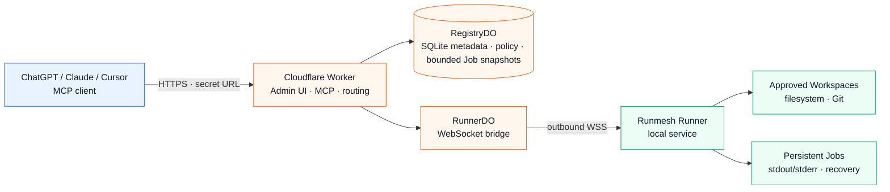

<p align="center">
  
</p>

<p align="center">
  <strong>Agent Control Plane for remote coding runtimes</strong>
</p>

<p align="center">
  Model-neutral · client-neutral · outbound-only
</p>

<p align="center">
  English · <a href="./README.zh-CN.md">简体中文</a>
</p>

<p align="center">
  <a href="https://github.com/aloneio/runmesh/actions/workflows/ci.yml?query=branch%3Adev"></a>
  <a href="https://developers.cloudflare.com/workers/"></a>
  <a href="https://nodejs.org/"></a>
  <a href="./LICENSE"></a>
</p>

<p align="center">
  <a href="#using-an-existing-runmesh-deployment">Use Runmesh</a> ·
  <a href="#self-hosting-for-administrators">Self-host</a> ·
  <a href="#mcp-tools">MCP Tools</a> ·
  <a href="./docs/security.md">Security</a> ·
  <a href="./docs/deployment.md">Deployment</a>
</p>

> [!IMPORTANT]
> Runmesh is **source-available under the PolyForm Noncommercial License 1.0.0**, not an OSI-approved open-source license. Commercial use requires separate written authorization; see [COMMERCIAL_LICENSE.md](docs/legal/COMMERCIAL_LICENSE.md).

> [!WARNING]
> `shell` is a host-shell capability, not a sandbox. Commands can access files, network resources, environment variables, credentials, and processes available to the Runner service identity. Use a restricted VM or container for untrusted code, and do not give a Runner more authority than necessary.

## What Runmesh does

Runmesh lets an MCP client use approved workspaces on one or more machines while keeping the execution machines private:

- **Cloudflare Worker** is the public control plane and MCP HTTP endpoint.
- **RegistryDO** stores authentication, Runner and Workspace records, policy state, client selection, and bounded Job metadata.
- **RunnerDO** maintains the authenticated outbound WebSocket bridge for a Runner. It coordinates messages but does not execute commands or access files.
- **Runner** is the local service that performs approved filesystem, Git, shell, and persistent Job operations.

Runmesh does not call an AI or model service API. Your MCP client remains responsible for reasoning. A disconnected browser, chat, MCP request, or Runner WebSocket does not stop a persistent Job that has already started.

## Using an existing Runmesh deployment

If an administrator has given you an MCP connection URL, you do **not** need Node.js, npm, Wrangler, a Cloudflare account, or this repository. Configure the exact URL in an MCP-compatible client such as ChatGPT, Claude, Cursor, or another client that supports Streamable HTTP:

```text
https://your-runmesh-host.example/<one-time-secret>/mcp
```

The URL is a credential. It is shown only when an administrator creates or rotates the MCP Client. Do not paste it into source control, screenshots, issue reports, analytics, or public chat. Do not add it to shell commands or configuration that will be shared with others. This self-hosted authentication flow does not require an OAuth callback or an additional Bearer token.

### First use

1. Call `runner_list` to see the Runners that the administrator has made available to this MCP Client.
2. If more than one Runner is available, call `runner_select({"runner_id":"..."})`. Switching an existing selection requires `confirm_switch: true`.
3. Call `runner_current` to confirm the sticky selection, then call `workspace_list` to see readable Workspace IDs.
4. Use `read` for files, `inspect` for bounded read-only inspection, `edit` when your Client and Workspace have write permission, and `shell` only when host execution is explicitly permitted.
5. Use `job` to list Jobs, read paginated output, send input, or cancel a Job when your permissions allow it.

A selection belongs to the MCP Client and remains sticky across requests. If exactly one Runner is available, the service may select it automatically. Runmesh does not silently fail over from a selected offline, stale, revoked, or unavailable Runner; select another Runner explicitly when appropriate.

Administrators—not MCP Clients—define Workspace roots and permissions. If the required Runner or Workspace is not listed, ask the administrator to review the deployment rather than trying to work around the restriction.

## Why Runmesh

| Capability | What it means for users |
| :-- | :-- |
| **One control plane** | A single MCP endpoint can route to approved Runners and Workspaces. |
| **Outbound-only Runner** | The execution machine initiates the connection; it does not need a public inbound port, SSH server, tunnel, or public IPv4 address. |
| **Explicit Workspace policy** | Administrators approve roots and permissions centrally. A policy must be validated and acknowledged before it becomes active. |
| **Persistent Jobs** | Long-running commands continue after the MCP request or WebSocket disconnects and expose bounded, UTF-8-safe output pages. |
| **Defense in depth** | Worker, Durable Object, and local Runner boundaries independently check identity, policy revisions, paths, permissions, and message sizes. |
| **No model lock-in** | Runmesh does not require a particular AI provider or call a model API. |

## Architecture



The Worker resolves the MCP Client's active Runner and checks effective permissions before forwarding a protected request. RunnerDO checks the current Registry policy revision and connection generation. The local Runner checks the policy again before touching the host.

## MCP tools

The default public catalog contains nine tools:

| Tool | Required scope | Purpose |
| :-- | :-- | :-- |
| `runner_list` | `coding:read` | List safe Runner IDs, display names, connection state, and availability. |
| `runner_current` | `coding:read` | Show this MCP Client's sticky Runner selection. |
| `runner_select` | `coding:read` | Select a Runner; switching requires `confirm_switch: true`. |
| `workspace_list` | `coding:read` | List readable Workspace IDs without exposing roots. |
| `inspect` | `coding:read` | Perform bounded `list`, `search`, `stat`, `git_status`, or `git_diff` inspection. |
| `read` | `coding:read` | Read a Workspace-relative file with UTF-8-safe pagination. |
| `edit` | `coding:write` | Apply a baseline-checked transactional multi-file patch. |
| `shell` | `coding:exec` | Start a persistent host-shell Job through the Runner's Bash or PowerShell runtime. |
| `job` | Depends on operation | List Jobs, inspect metadata, read logs, send input, or cancel Jobs. |

Runner RPC names such as `fs.*`, `exec.*`, `job.*`, `git.*`, and `env.*` are private transport capabilities. They are not additional public MCP tools and are not advertised by `tools/list`.

### Permissions

Effective access is the intersection of:

```text
MCP Client scopes
  ∩ Client × Runner restriction
  ∩ Runner policy
  ∩ Workspace policy
```

A Client×Runner restriction can only reduce access. It cannot grant a scope that the MCP Client does not already have. Permission dependencies are normalized consistently: `edit` requires `read`; `shell` requires `read`, `edit`, and `job_control`; `job_control` allows control of existing Jobs without granting shell access.

While a central policy is pending, rejected, invalid, offline-pending, or revision-mismatched, ordinary operations fail closed with a structured `policy_pending` or `permission_denied` result. Existing Jobs continue by default when permissions are tightened; an administrator must explicitly request termination if running Jobs should be stopped.

### Files and inspection

- Paths are Workspace-relative. Absolute paths, drive paths, UNC/device paths, NUL bytes, traversal, symlink escapes, and writes through symlinks are rejected.
- `read` and Job logs use bounded UTF-8-safe cursors so multibyte text can be reconstructed page by page without replacement characters.
- `edit` supports Add, Update, Delete, and Move patches with expected-hash/baseline checks, staging, atomic replacement where available, rollback, and bounded structured results.
- `inspect` is read-only and bounded by result count, bytes, depth, and operation timeout. It does not return local root paths.

### Shell and Jobs

`shell` always creates a persistent Job. A background request returns promptly; a foreground request waits only within a bounded budget and returns a `job_id` when more work remains. The current local foreground budget is 8 seconds and the Worker-to-Runner bridge budget is 12 seconds.

A Workspace identifies the initial working directory, policy, and audit context. It is **not** a shell root: a command may change directory and access anything permitted to the Runner service identity. Use an external sandbox or VM for untrusted execution.

Public Job metadata is redacted. RegistryDO retains bounded history so a Client can discover retained Jobs while the selected Runner is offline; complete stdout/stderr remains on the Runner and is read through pagination. When retention limits discard output, the Job reports `output_truncated: true` rather than consuming unlimited local disk.

## Self-hosting for administrators

This section is for the person deploying and operating a Runmesh instance. It is not required when you are only configuring an MCP Client URL.

### Deploy the control plane

The current implementation uses one Worker with SQLite-backed Durable Objects. It does not require D1, R2, Queues, Sandbox, Containers, a public Runner HTTP server, a tunnel, an inbound SSH service, OAuth, or a model provider. Account quotas and production behavior still depend on the Cloudflare account and plan; local validation is not proof of production capacity.

From a source checkout, the maintainer can run the local checks:

```sh
npm ci
npm run check:versions
npm run typecheck
npm run test:unit
npm run test:e2e
npm run build
npm run validate:worker
npm run pack:smoke
npm run check:licenses
```

`npm run validate:worker` is a Wrangler dry-run. It does not deploy, test production Durable Object migrations, prove edge-log redaction, or verify external Internet clients.

Before making the instance publicly reachable, configure these four Worker secrets:

```sh
cd apps/worker
npm exec --offline -- wrangler secret put ADMIN_TOKEN
npm exec --offline -- wrangler secret put SETUP_TOKEN          # or configure SETUP_TOKEN_HASH instead
npm exec --offline -- wrangler secret put RUNNER_TOKEN_PEPPER
npm exec --offline -- wrangler secret put INTERNAL_CONTROL_SECRET
npm exec --offline -- wrangler deploy --config wrangler.jsonc
```

The first administrator setup requires the configured `SETUP_TOKEN` or the SHA-256 verifier in `SETUP_TOKEN_HASH`; the setup token is never stored in RegistryDO or displayed by the dashboard. First setup is atomic and first-success-wins, so an uninitialized public instance must be protected by deployment access controls until the intended administrator completes setup. `ADMIN_TOKEN` is only for the manual/programmatic Runner administration API. It is not an administrator-password replacement, browser cookie, MCP credential, or Runner enrollment code.

Open the deployed root URL, set the administrator password with the setup token, and sign in. The dashboard then provides the normal flows to create and manage Runners, generate one-time enrollment codes, define managed Workspaces, review policy status, create MCP Clients, and rotate or revoke credentials.

#### GitLab CI/CD deployment

This repository does not deploy automatically on push. A GitLab deployment pipeline should be a protected, manually triggered job using the same pinned commit that was validated in GitLab CI. Configure masked/protected GitLab variables for `CLOUDFLARE_API_TOKEN` and `CLOUDFLARE_ACCOUNT_ID`; use a narrowly scoped token limited to the target account and Workers deployment permissions.

The deploy job must run the complete validation sequence before `npm exec --offline -- wrangler deploy --config apps/worker/wrangler.jsonc --strict`; the resulting Worker is named `runmesh`. It must not print or store Worker secrets. Set Cloudflare Worker secrets separately with `wrangler secret put` or `wrangler secret bulk`; do not put application secrets in the repository or ordinary CI variables.

A deploy is a production-affecting operation. Review the exact commit, target account, Worker name, Durable Object migration changes, and backup/recovery plan before manually starting it. Local `wrangler login` confirms only the currently authenticated account; it does not authorize deployment without an explicit operator action.

### Runner onboarding

The dashboard-generated enrollment code is short-lived, single-use, and invalidated when regenerated or redeemed. The Runner connects outward to the Worker over authenticated WebSocket; it does not expose an HTTP server.

Hosted bootstrap is unavailable in `v0.1.0-dev.2`. `/runner/releases/latest` and `/runner/releases/stable` report `distributable: false`; they expose no package specification or artifact, and the generated installers fail closed. Download the portable artifact plus its manifest, signature, and checksums, then follow the complete [portable Runner verification and installation procedure](docs/portable-runner-installation.md). Signature verification must use the trust keyring from an independently trusted source checkout, never the keyring downloaded beside the artifact. After verification, run `coding-runner enroll` followed by `coding-runner install`. Automatic signed bootstrap, update, and rollback are not included in this preview.

Fresh enrollment starts with zero Workspaces. Workspace roots are added explicitly by an administrator through the dashboard and delivered privately to the selected Runner as policy data. Re-enrollment changes connection credentials without inventing a Workspace from the current directory. Browser Emergency Lock requires typing the Runner ID and locks future policy permissions without automatically stopping existing Jobs.

### Credentials and security

- MCP Client URLs contain high-entropy path credentials and are displayed only at creation or rotation. Rotate or revoke them immediately if exposed.
- Runner enrollment codes are verifier-only, time-limited, and single-use. Runner credential rotation/revocation invalidates old credentials and closes the current connection.
- The administrator password is stored as a salted PBKDF2-HMAC-SHA-256 verifier. Browser sessions are opaque, HttpOnly, Secure, and SameSite cookies.
- Internal Worker-to-Durable-Object requests use versioned HMAC bound to the method, full path/query, timestamp, nonce, and body digest. Replayed or expired requests are rejected.
- Absolute Workspace roots are private control-plane policy data. They are not returned to MCP Clients, public endpoints, ordinary logs, or errors.
- A Runner running as root, Administrator, or another powerful service identity still has that host authority. Runmesh policy is not an operating-system sandbox.

## Not included in v0.1.0-dev.2

This development preview includes policy-gated workspace access, sticky Runner selection, persistent local Jobs, offline Registry snapshots, authenticated Runner transport, and MCP Client base-scope editing. The following capabilities are outside the current preview and are roadmap candidates rather than compatibility commitments: Audit Log, Policy history/rollback UI, automatic Runner update/rollback, complete signed hosted bootstrap, SBOM publication, Reset runtime, enterprise multi-tenancy, and real-host macOS/Windows service E2E.

Before operational use, administrators should validate the target deployment and host:

- Cloudflare account quotas, CPU limits, Durable Object migrations, hibernation/restart behavior, and edge-log redaction;
- external MCP client behavior and infrastructure handling of secret-bearing URL paths;
- manual verified-portable-artifact installation and service provisioning on the target OS;
- native service lifecycle and least-privilege behavior on macOS and Windows;
- artifact manifest/signature verification and their own recovery procedures.

Hosted bootstrap is unavailable in this preview. Use a manually verified portable artifact; automatic Runner update/download/rollback remains outside this preview.

Runmesh is not an operating-system sandbox, and this preview does not include tenant isolation, automatic failover, inbound SSH, a public Runner HTTP server, a hosted IDE, billing, Teams/organizations, MCP Tasks, PTY/Web Terminal, browser automation, an AI agent, RAG, or a model gateway. Those exclusions describe the current preview scope, not a permanent compatibility commitment.

## Documentation

- [Portable Runner installation](docs/portable-runner-installation.md) — trusted-key verification, SHA-256 checks, local `.tgz` installation, and version confirmation.
- [Deployment](docs/deployment.md) — administrator setup, Worker secrets, Runner enrollment, and migration cautions.
- [Security](docs/security.md) — credentials, host-shell risk, policy enforcement, and threat boundaries.
- [Architecture](docs/architecture.md) — components, trust boundaries, and data flow.
- [Runner transport](docs/runner-transport.md) — outbound WebSocket, protocol versions, heartbeat, sync, and Jobs.
- [Protocol](docs/protocol.md) — typed wire messages, policy revisions, checksums, and limits.
- [Migration](docs/migration.md) — additive schema changes, legacy profiles, and rollback precautions.
- [.github/SECURITY.md](.github/SECURITY.md) — vulnerability reporting.
- [.github/CONTRIBUTING.md](.github/CONTRIBUTING.md) — complete contribution terms and process.

## License and community

Runmesh is source-available under the [PolyForm Noncommercial License 1.0.0](LICENSE). It is **not** OSI-approved open-source software. Commercial use or additional rights require a separate written agreement; see [COMMERCIAL_LICENSE.md](docs/legal/COMMERCIAL_LICENSE.md).

Community contributions are welcome. See [.github/CONTRIBUTING.md](.github/CONTRIBUTING.md) for the complete contribution terms and process. See [NOTICE](NOTICE) and [THIRD_PARTY_NOTICES.md](THIRD_PARTY_NOTICES.md) for notices, [docs/legal/TRADEMARKS.md](docs/legal/TRADEMARKS.md) for name/logo guidance, and [.github/SECURITY.md](.github/SECURITY.md) for security reports.

Runmesh is an independent implementation. Design research considered [coding-tools-mcp](https://github.com/xyTom/coding-tools-mcp), [volter-tunnel](https://github.com/volter-ai/volter-tunnel), [agent-mcp-gateway](https://github.com/Hiroshimeow/agent-mcp-gateway), and official Cloudflare/MCP documentation. These are research acknowledgements only; no referenced source or asset is claimed as included.
