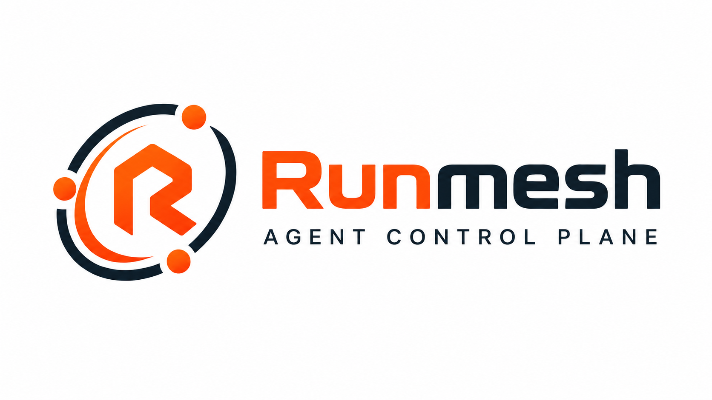
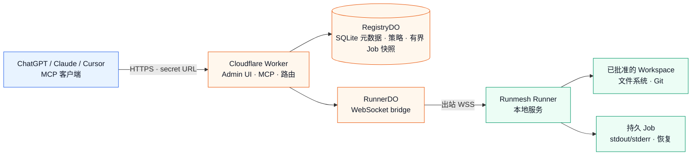

<p align="center">
  
</p>

<p align="center">
  <strong>面向远程编码运行时的智能体控制平面</strong>
</p>

<p align="center">
  模型无关 · 客户端无关 · 仅出站连接
</p>

<p align="center">
  <a href="./README.md">English</a> · 简体中文
</p>

<p align="center">
  <a href="https://github.com/aloneio/runmesh/actions/workflows/ci.yml?query=branch%3Adev"></a>
  <a href="https://developers.cloudflare.com/workers/"></a>
  <a href="https://nodejs.org/"></a>
  <a href="./LICENSE"></a>
</p>

<p align="center">
  <a href="#使用已有的-runmesh-部署">使用 Runmesh</a> ·
  <a href="#管理员自托管">自托管</a> ·
  <a href="#mcp-工具">MCP 工具</a> ·
  <a href="./docs/security.md">安全模型</a> ·
  <a href="./docs/deployment.md">部署文档</a>
</p>

> [!IMPORTANT]
> Runmesh 依据完整的 **PolyForm Noncommercial License 1.0.0** 以源码可用形式提供，**不是** OSI 认可的开源许可证。商业使用需要单独的书面授权，请查看 [COMMERCIAL_LICENSE.zh-CN.md](docs/legal/COMMERCIAL_LICENSE.zh-CN.md)。

> [!WARNING]
> `shell` 是宿主机 Shell 能力，不是沙箱。命令可以访问 Runner 服务身份在宿主机上可访问的文件、网络、环境变量、凭据和进程。运行不受信任的代码时请使用受限 VM 或容器，并避免给 Runner 授予不必要的 root/Administrator 权限。

## Runmesh 是什么

Runmesh 让 MCP 客户端可以使用一台或多台机器上经过批准的 Workspace，同时保持执行机器不对公网开放：

- **Cloudflare Worker** 是公网控制平面和 MCP HTTP endpoint；
- **RegistryDO** 保存认证、Runner、Workspace、策略、客户端选择和有界 Job 元数据；
- **RunnerDO** 为每个 Runner 维护认证后的出站 WebSocket bridge，只负责协调和转发，不执行命令或访问文件；
- **Runner** 是本地服务，负责执行获准的文件系统、Git、Shell 和持久 Job 操作。

Runmesh 不调用任何 AI 或模型服务 API，推理由你的 MCP 客户端完成。浏览器、聊天窗口、MCP 请求或 Runner WebSocket 断开，都不会停止已经启动的持久 Job。

## 使用已有的 Runmesh 部署

如果管理员已经给你 MCP 连接 URL，你**不需要** Node.js、npm、Wrangler、Cloudflare 账户或本仓库。将完整 URL 配置到支持 Streamable HTTP 的 MCP 客户端，例如 ChatGPT、Claude、Cursor 或其他兼容客户端：

```text
https://your-runmesh-host.example/<one-time-secret>/mcp
```

这个 URL 就是凭据。它只在管理员创建或轮换 MCP Client 时显示一次。不要把它粘贴到源码、截图、Issue、分析系统或公开聊天中，也不要加入会分享给他人的命令或配置。当前 self-hosted 认证流程不需要 OAuth callback 或额外 Bearer token。

### 第一次使用

1. 调用 `runner_list`，查看管理员为该 MCP Client 开放的 Runner。
2. 如果有多个 Runner，调用 `runner_select({"runner_id":"..."})`。切换已有选择时需要 `confirm_switch: true`。
3. 调用 `runner_current` 确认 sticky 选择，再调用 `workspace_list` 查看可读的 Workspace ID。
4. 使用 `read` 读取文件，使用 `inspect` 进行有界只读检查；只有 Client 和 Workspace 都有写权限时才使用 `edit`；只有明确允许宿主执行时才使用 `shell`。
5. 在权限允许时，使用 `job` 列出 Job、读取分页输出、发送输入或取消 Job。

选择属于 MCP Client，会跨请求保持。只有一个 Runner 时，服务可以自动选择它。选中的 Runner 离线、stale、revoked 或不可用时，Runmesh 不会静默切换；需要时请显式选择其他 Runner。

Workspace 根目录和权限由管理员定义，而不是由 MCP Client 自己决定。如果需要的 Runner 或 Workspace 没有出现，请联系管理员，不要尝试绕过限制。

## 核心能力

| 能力 | 对用户意味着什么 |
| :-- | :-- |
| **一个控制平面** | 一个 MCP endpoint 可以路由到已批准的 Runner 和 Workspace。 |
| **仅出站 Runner** | 执行机器主动建立连接，不需要公网入站端口、SSH 服务、Tunnel 或公网 IPv4。 |
| **显式 Workspace 策略** | 管理员集中批准根目录和权限；策略必须验证并 ACK 后才会生效。 |
| **持久 Job** | 长命令在 MCP 请求或 WebSocket 断开后继续运行，并提供有界、UTF-8 安全的输出分页。 |
| **纵深防御** | Worker、Durable Object 和本地 Runner 分别校验身份、策略版本、路径、权限和消息大小。 |
| **不绑定模型** | Runmesh 不要求特定 AI 服务，也不会调用模型 API。 |

## 架构



Worker 会解析 MCP Client 的 active Runner，并在转发受保护请求前检查有效权限；RunnerDO 检查 Registry 中的当前策略版本和连接世代；本地 Runner 在访问宿主机前再次检查策略。

## MCP 工具

默认公网工具目录包含 9 个工具：

| 工具 | 所需 scope | 用途 |
| :-- | :-- | :-- |
| `runner_list` | `coding:read` | 列出安全的 Runner ID、显示名称、连接状态和可用性。 |
| `runner_current` | `coding:read` | 查看当前 MCP Client 的 sticky Runner 选择。 |
| `runner_select` | `coding:read` | 选择 Runner；切换时需要 `confirm_switch: true`。 |
| `workspace_list` | `coding:read` | 列出可读 Workspace ID，不暴露根目录。 |
| `inspect` | `coding:read` | 有界执行 `list`、`search`、`stat`、`git_status` 或 `git_diff` 检查。 |
| `read` | `coding:read` | 使用 UTF-8 安全分页读取 Workspace 相对文件。 |
| `edit` | `coding:write` | 执行带 baseline 检查的事务性多文件 patch。 |
| `shell` | `coding:exec` | 通过 Runner 的 Bash 或 PowerShell 启动持久宿主 Shell Job。 |
| `job` | 按操作决定 | 列出 Job、查看元数据、读日志、发送输入或取消 Job。 |

`fs.*`、`exec.*`、`job.*`、`git.*` 和 `env.*` 等 Runner RPC 是私有传输能力，不是额外的公网 MCP 工具，也不会被 `tools/list` 宣传。

### 权限

有效权限是以下集合的交集：

```text
MCP Client scopes
  ∩ Client × Runner 限制
  ∩ Runner policy
  ∩ Workspace policy
```

Client×Runner 限制只能收紧权限，不能授予 MCP Client 没有的 scope。权限依赖统一归一化：`edit` 要求 `read`；`shell` 要求 `read`、`edit` 和 `job_control`；`job_control` 可以在没有 Shell 权限时控制已有 Job。

中央策略处于 pending、rejected、invalid、offline-pending 或 revision 不一致状态时，普通操作会 fail closed，并返回结构化 `policy_pending` 或 `permission_denied`。权限收紧默认不会杀掉已经运行的 Job；如需终止，管理员必须显式请求。

### 文件与检查

- 路径必须是 Workspace 相对路径；绝对路径、盘符路径、UNC/device 路径、NUL、traversal、symlink escape 和通过 symlink 写入都会被拒绝；
- `read` 和 Job 日志使用有界 UTF-8 安全 cursor，分页拼接多字节文本时不会产生 replacement character；
- `edit` 支持 Add、Update、Delete、Move，并执行 expected-hash/baseline 检查、staging、原子替换、rollback 和有界结构化结果；
- `inspect` 只读，并限制结果数量、字节数、深度和执行时间，不返回本地 root。

### Shell 与 Job

`shell` 总是创建持久 Job。后台请求会快速返回；前台请求只在有界预算内等待，未完成时返回 `job_id`。当前本地前台预算为 8 秒，Worker-to-Runner bridge 预算为 12 秒。

Workspace 定义初始工作目录、策略和审计上下文，但**不是** Shell root。命令可以自行切换目录，并访问 Runner 服务身份允许访问的资源。不受信任的执行必须使用外部 sandbox 或 VM。

公网 Job metadata 会被脱敏。RegistryDO 保留有界历史，使选中的 Runner 离线时仍可发现保留的 Job；完整 stdout/stderr 保存在 Runner 本地并通过分页读取。日志超出保留上限时返回 `output_truncated: true`，不会无限占用磁盘。

## 管理员自托管

本节面向部署和维护 Runmesh 的管理员。如果你只是配置 MCP Client URL，则不需要执行本节。

### 部署控制平面

当前实现使用一个带 SQLite-backed Durable Objects 的 Worker，不需要 D1、R2、Queues、Sandbox、Containers、公网 Runner HTTP server、Tunnel、入站 SSH 服务、OAuth 或模型服务。账户配额和生产行为取决于 Cloudflare 账户与套餐；本地验证不能证明生产容量。

从源码 checkout 进行本地验证：

```sh
npm ci
npm run check:versions
npm run typecheck
npm run test:unit
npm run test:e2e
npm run build
npm run validate:worker
npm run pack:smoke
npm run check:licenses
```

`npm run validate:worker` 是 Wrangler dry-run，不会部署，也不能测试生产 Durable Object migration、edge log 脱敏或外部 Internet 客户端兼容性。

让实例对公网开放前，配置以下四个 Worker secrets：

```sh
cd apps/worker
npm exec --offline -- wrangler secret put ADMIN_TOKEN
npm exec --offline -- wrangler secret put SETUP_TOKEN          # 或改为配置 SETUP_TOKEN_HASH
npm exec --offline -- wrangler secret put RUNNER_TOKEN_PEPPER
npm exec --offline -- wrangler secret put INTERNAL_CONTROL_SECRET
npm exec --offline -- wrangler deploy --config wrangler.jsonc
```

首次管理员 setup 必须提供已配置的 `SETUP_TOKEN` 或 `SETUP_TOKEN_HASH` 中的 SHA-256 verifier；setup token 不会保存到 RegistryDO，也不会由 Dashboard 显示。首次初始化采用原子化 first-success-wins，因此未初始化的公网实例必须先使用部署访问控制保护，直到预期管理员完成 setup。`ADMIN_TOKEN` 仅用于手工/程序化 Runner 管理 API，不是管理员密码替代品、浏览器 cookie、MCP 凭据或 Runner enrollment code。

打开部署后的根地址，使用 setup token 设置管理员密码并登录。随后 Dashboard 可用于创建和管理 Runner、生成一次性 enrollment code、定义 managed Workspace、查看 policy 状态、创建 MCP Client 以及轮换或撤销凭据。

#### GitLab CI/CD 部署

本仓库不会在 push 时自动部署。GitLab 部署 pipeline 应是受保护且手动触发的 job，并且只能部署已经在 GitLab CI 中验证过的同一个固定 commit。请在 GitLab 中配置 masked/protected variables：`CLOUDFLARE_API_TOKEN` 和 `CLOUDFLARE_ACCOUNT_ID`；token 权限应尽量收窄到目标账户和 Workers 部署操作。

部署 job 必须在 `npm exec --offline -- wrangler deploy --config apps/worker/wrangler.jsonc --strict` 前完成完整验证；部署后的 Worker 名称为 `runmesh`。不得打印或保存应用 secrets。请单独使用 `wrangler secret put` 或 `wrangler secret bulk` 设置 Cloudflare Worker secrets，不要把应用 secrets 放入仓库或普通 CI variables。

部署会影响生产环境。手动启动前请复核精确 commit、目标账户、Worker 名称、Durable Object migration 变化以及备份/恢复方案。本地 `wrangler login` 只能证明当前登录账户，不代表已经执行部署授权。

### Runner 注册

Dashboard 生成的 enrollment code 短期有效、单次使用，重新生成或成功兑换后立即失效。Runner 通过认证 WebSocket 主动连接 Worker，不暴露 HTTP server。

在 `v0.1.0-dev.2` 中，hosted bootstrap 不可用。`/runner/releases/latest` 和 `/runner/releases/stable` 返回 `distributable: false`，不提供 package spec 或 artifact，生成的安装脚本会 fail closed。请下载 portable artifact 及其 manifest、signature、checksums，并按照[便携式 Runner 验证与安装流程](docs/portable-runner-installation.md)操作。签名验证必须使用独立可信源代码 checkout 中的 trust keyring，不能使用与 artifact 一起下载的 keyring。验证完成后运行 `coding-runner enroll`，再运行 `coding-runner install`。自动 signed bootstrap、更新和回滚尚未包含。

全新注册从零 Workspace 开始。Workspace 根目录由管理员在 Dashboard 显式添加，再通过认证的 Runner-only policy frame 私下发送给对应 Runner；它不会进入 MCP、Workspace metadata、普通日志或公网 API。重新注册只更新连接凭据，不会从当前目录创建 Workspace。Emergency Lock 要求输入 Runner ID，并不会自动终止已经启动的 Job。

### 凭据与安全

- MCP Client URL 包含高熵路径凭据，只在创建或轮换时显示；一旦泄露应立即轮换或撤销；
- Runner enrollment code 只保存 verifier、限时有效且单次使用；Runner credential 轮换/撤销会使旧凭据失效并关闭当前连接；
- 管理员密码保存为带随机 salt 的 PBKDF2-HMAC-SHA-256 verifier；浏览器 session 使用 opaque、HttpOnly、Secure、SameSite cookie；
- Worker 到 Durable Object 的内部请求使用带版本的 HMAC，绑定 method、完整 path/query、timestamp、nonce 和 body digest；重放或过期请求会被拒绝；
- 绝对 Workspace 根目录是私有控制平面 policy 数据，不会返回给 MCP Client、公网 endpoint、普通日志或错误；
- Runner 即使以 root、Administrator 或其他高权限身份运行，也仍然拥有相应宿主机 authority；Runmesh policy 不是操作系统 sandbox。

## 本开发预览版尚未包含

本开发预览版包含策略保护的 Workspace 访问、粘性 Runner 选择、持久 Job、离线 Registry 快照、认证 Runner 传输，以及 MCP Client base-scope 在线编辑。以下能力不在当前预览版范围内，属于候选路线图而非兼容性承诺：Audit Log、Policy history/rollback UI、自动 Runner 更新/回滚、完整 signed hosted bootstrap、SBOM 发布、Reset runtime、企业多租户，以及 macOS/Windows 实机服务 E2E。

投入运行前，管理员应在目标环境验证：

- Cloudflare 账户配额、CPU 限制、Durable Object migration、hibernation/restart 和 edge-log 脱敏；
- 外部 MCP 客户端行为，以及基础设施对包含凭据的 URL path 的日志处理；
- 手工验证 portable artifact 后的安装与目标操作系统服务 provision；
- macOS 与 Windows 的原生服务生命周期和低权限行为；
- artifact manifest/signature 校验和自身的恢复流程。

本预览版中的 hosted bootstrap 不可用。请使用手工验证的 portable artifact；自动 Runner 更新、下载和回滚不在当前预览版范围内。

Runmesh 不是操作系统级 sandbox；当前预览版也不包含租户隔离、自动 failover、入站 SSH、公网 Runner HTTP server、Hosted IDE、计费、Teams/组织、MCP Tasks、PTY/Web Terminal、浏览器自动化、AI Agent、RAG 或模型网关。这些描述的是当前预览版范围，不是永久性的兼容性承诺。

## 文档导航

- [便携式 Runner 安装](docs/portable-runner-installation.md) — 可信 key 验证、SHA-256 校验、本地 `.tgz` 安装和版本确认；
- [部署](docs/deployment.md) — 管理员 setup、Worker secrets、Runner enrollment 和迁移注意事项；
- [安全](docs/security.md) — 凭据、Host shell 风险、策略执行和威胁边界；
- [架构](docs/architecture.md) — 组件、信任边界和数据流；
- [Runner transport](docs/runner-transport.md) — 出站 WebSocket、协议版本、心跳、同步和 Job；
- [协议](docs/protocol.md) — typed wire message、策略版本、checksum 和限制；
- [迁移](docs/migration.md) — additive schema、旧 profile 和 rollback 注意事项；
- [.github/SECURITY.zh-CN.md](.github/SECURITY.zh-CN.md) — 漏洞报告；
- [.github/CONTRIBUTING.zh-CN.md](.github/CONTRIBUTING.zh-CN.md) — 完整的贡献条款和流程。

## 许可证与社区

Runmesh 依据 [PolyForm Noncommercial License 1.0.0](LICENSE) 以源码可用形式提供，**不是** OSI 认可的开源软件。商业使用或额外权利需要单独书面授权，请查看 [COMMERCIAL_LICENSE.zh-CN.md](docs/legal/COMMERCIAL_LICENSE.zh-CN.md)。

欢迎社区贡献。请查看 [.github/CONTRIBUTING.zh-CN.md](.github/CONTRIBUTING.zh-CN.md) 了解完整的贡献条款和流程。通知见 [NOTICE](NOTICE) 和 [docs/legal/THIRD_PARTY_NOTICES.zh-CN.md](docs/legal/THIRD_PARTY_NOTICES.zh-CN.md)，名称和徽标使用见 [docs/legal/TRADEMARKS.zh-CN.md](docs/legal/TRADEMARKS.zh-CN.md)，安全问题请通过 [.github/SECURITY.zh-CN.md](.github/SECURITY.zh-CN.md) 报告。

Runmesh 是独立实现。设计研究参考了 [coding-tools-mcp](https://github.com/xyTom/coding-tools-mcp)、[volter-tunnel](https://github.com/volter-ai/volter-tunnel)、[agent-mcp-gateway](https://github.com/Hiroshimeow/agent-mcp-gateway) 以及 Cloudflare/MCP 官方文档，仅用于行为和架构研究，不表示包含其源码或资产。
