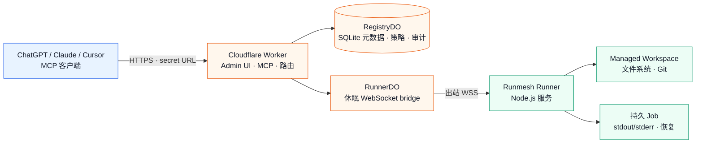

<p align="center">
  
</p>

<p align="center">
  <strong>面向远程编码运行时的智能体控制平面</strong>
</p>

<p align="center">
  模型无关 · 客户端无关 · 仅出站连接
</p>

<p align="center">
  <a href="./README.md">English</a> · 简体中文
</p>

<p align="center">
  <a href="https://github.com/aloneio/runmesh/actions/workflows/ci.yml?query=branch%3Adev"></a>
  <a href="https://developers.cloudflare.com/workers/"></a>
  <a href="https://nodejs.org/"></a>
  <a href="./LICENSE"></a>
</p>

<p align="center">
  <a href="#快速开始">快速开始</a> ·
  <a href="#架构">架构</a> ·
  <a href="#mcp-工具">MCP 工具</a> ·
  <a href="./docs/security.md">安全模型</a> ·
  <a href="./docs/deployment.md">部署文档</a>
</p>

> [!IMPORTANT]
> Runmesh 依据完整的 **PolyForm Noncommercial License 1.0.0** 以源码可用形式提供，**不是** OSI 认可的开源许可证。商业使用需要单独的书面授权，请查看 [COMMERCIAL_LICENSE.zh-CN.md](COMMERCIAL_LICENSE.zh-CN.md)。

> [!WARNING]
> `shell` 是宿主机 Shell 能力，不是沙箱。命令可以访问 Runner 服务身份在宿主机上可访问的文件、网络、环境变量、凭据和进程。运行不受信任的代码时请使用受限 VM 或容器，并避免给 Runner 授予不必要的 root/Administrator 权限。

## 项目简介

Runmesh 将 MCP 客户端连接到一台或多台机器，同时不要求这些机器暴露公网服务：

- **Cloudflare Worker**：唯一的公网控制平面和 MCP endpoint。
- **RegistryDO**：保存认证、Runner、Workspace、策略、选择、审计和有界 Job 元数据。
- **RunnerDO**：为每个 Runner 持有一条经过认证的出站 WebSocket，并转发关联 RPC；它不执行代码。
- **Runner**：本地 Node.js 服务，负责文件系统、Git、Shell 和持久 Job。

MCP 客户端负责推理，Runmesh 不调用任何 AI/模型服务 API。关闭浏览器、聊天窗口、MCP 请求或 Runner WebSocket，都不会停止已经启动的持久 Job。

## 核心能力

| 能力 | 说明 |
| :-- | :-- |
| **集中式控制平面** | 一个 Worker 地址管理多个 Runner 和 Workspace，并提供管理员 Dashboard。 |
| **仅出站 Runner** | 本地服务主动建立 `wss://` 连接，不需要公网 IPv4、入站端口、Tunnel、SSH 或反向代理服务。 |
| **显式 Workspace 策略** | 管理员集中定义 Workspace 根目录和权限；策略必须经 Runner 校验并 ACK 后才会生效。 |
| **精简 MCP 面** | 9 个稳定工具覆盖 Runner 选择、Workspace 发现、检查、读取、编辑、Shell Job 和 Job 管理。 |
| **持久 Job** | 长命令在请求或 WebSocket 断开后继续执行，并提供有界、UTF-8 安全的输出分页。 |
| **纵深防御** | Worker、Durable Object 和本地 Runner 分别校验身份、策略版本、路径、权限和 payload 大小。 |
| **面向 Free Plan 的核心** | 核心只依赖 Workers 与 SQLite-backed Durable Objects，不要求 D1、R2、Queues、Sandbox、Containers 或模型服务。 |

## 架构



Worker 会解析 MCP Client 的 sticky active Runner，并在转发前检查有效权限；RunnerDO 验证 Registry 中的当前策略版本和连接世代；本地 Runner 在访问宿主机前再次执行策略检查。

## 快速开始

推荐使用 **Panel-first** 流程。不要一开始就暴露 `ADMIN_TOKEN`，也不要手动编写 Runner profile。

### 1. 安装并进行本地验证

需要 Node.js 20+、npm、Git、Wrangler，以及启用 SQLite-backed Durable Objects 的 Cloudflare 账户。

```sh
git clone https://github.com/aloneio/runmesh.git
cd runmesh
npm ci
npm test
npm run typecheck
npm run build
npm run validate:worker
```

`npm run validate:worker` 只是本地 Wrangler dry-run，不会部署，也不能证明账户配额或生产边缘日志行为。

### 2. 配置并部署控制平面

部署前配置以下 Wrangler secrets：

```sh
cd apps/worker
npx wrangler secret put ADMIN_TOKEN
npx wrangler secret put SETUP_TOKEN          # 或 SETUP_TOKEN_HASH
npx wrangler secret put RUNNER_TOKEN_PEPPER
npx wrangler secret put INTERNAL_CONTROL_SECRET
npx wrangler deploy --config wrangler.jsonc
```

首次管理员设置同时需要 `SETUP_TOKEN`（或其 SHA-256 十六进制摘要 `SETUP_TOKEN_HASH`）和管理员密码。Setup token 会以常量时间方式校验，只用于首次初始化，不会作为管理员密码持久化。`ADMIN_TOKEN` 只用于高级的程序化 Runner 管理 API，不是浏览器 session、MCP 凭据或 Runner token。

### 3. 创建管理员账户

打开部署后的根地址，例如 `https://runmesh.example.com/`，完成 **Create administrator password**。首次 setup 采用原子化 first-success-wins；密码保存为带随机 salt 的 PBKDF2-HMAC-SHA-256 verifier，浏览器会话使用 opaque、HttpOnly、Secure、SameSite cookie。

### 4. 添加并注册 Runner

进入 **Admin → Runners**：

1. 使用显示名称和可选的安全 Runner ID 创建 Runner；
2. 复制一次性 enrollment code。它 30 分钟后过期，重新生成或成功兑换后立即失效；
3. 在具备管理员/root 权限的终端执行生成的 Linux/macOS 或 Windows 命令；
4. 等待 Runner 上线。

Bootstrap endpoint 不包含长期凭据，且只有在管理员配置稳定的可分发 Runner package descriptor 后才会继续。当前 bootstrap 仍要求目标机器已有 Node.js 20+ 和 npm；不会下载可变的 GitHub 分支，也不会在 Admin HTML 中暴露长期 credential。

全新 enrollment 创建的 Runner **没有任何 Workspace**。重新注册只替换连接凭据，不会从当前目录推断 Workspace。

### 5. 添加受批准的 Workspace

打开 Runner 详情页，创建一个 managed Workspace，选择 **Read Only** 或 **Coding** 等权限 profile，确认绝对根路径，并等待 Runner ACK 策略。

绝对 Workspace 根路径属于控制平面策略数据，会私下发送给对应 Runner。它只在已认证的 Admin Panel 中显示，不会返回给 MCP 客户端，不会进入公网 endpoint、普通日志或错误信息。

### 6. 创建 MCP Client URL

进入 **Admin → MCP Clients**，创建客户端名称，并按最小权限授予 scope：

- `coding:read` — 发现、检查、读取和只读 Job 查询；
- `coding:write` — 事务性 `edit`；
- `coding:exec` — `shell`、Job 输入和 Job 取消。

立即复制生成的一次性 URL，并直接配置到 MCP 客户端：

```text
https://runmesh.example.com/<one-time-secret>/mcp
```

原始 URL 只在创建或轮换时显示一次。它是路径凭据，不要放进截图、源码、分析系统或聊天记录。当前 single-admin self-hosted 流程不需要 OAuth callback 或额外 Bearer header。

### 7. 选择 Runner

使用 MCP 路由工具：

```text
runner_list()
runner_current()
runner_select({"runner_id":"home-pc"})
```

选择会按 MCP Client 持久化，而不是按聊天或请求保存。切换已经选中的 Runner 时必须显式确认：

```text
runner_select({"runner_id":"office-pc","confirm_switch":true})
```

选中的 Runner 离线、stale、revoked 或不可用时，不会自动切换到其他 Runner。请检查 `runner_current` 并显式选择新的 Runner。

## MCP 工具

默认公网工具目录保持精简且稳定：

| 工具 | Scope | 用途 |
| :-- | :-- | :-- |
| `runner_list` | `coding:read` | 列出安全 Runner ID、显示名称、连接状态和可用性。 |
| `runner_current` | `coding:read` | 查看当前 MCP Client 的 sticky Runner 选择。 |
| `runner_select` | `coding:read` | 选择 Runner；切换时需要 `confirm_switch: true`。 |
| `workspace_list` | `coding:read` | 列出可读 Workspace ID，不暴露根路径。 |
| `inspect` | `coding:read` | 有界执行 `list`、`search`、`stat`、`git_status` 或 `git_diff`。 |
| `read` | `coding:read` | UTF-8 安全分页读取 Workspace 相对文件。 |
| `edit` | `coding:write` | 执行带 baseline 检查的事务性多文件 patch。 |
| `shell` | `coding:exec` | 通过 Bash 或 PowerShell 启动持久宿主 Shell Job。 |
| `job` | 混合 | 列表、查看、分页日志、发送输入或取消持久 Job。 |

`fs.*`、`exec.*`、`job.*`、`git.*` 和 `env.*` 等 Runner RPC 仍是私有传输能力，不是额外 MCP 工具，也不会被 `tools/list` 宣传。

### 权限模型

有效权限是以下集合的交集：

```text
MCP Client scopes
  ∩ Client × Runner 限制
  ∩ Runner policy
  ∩ Workspace policy
```

限制只能收紧权限，不能授予 Client 原本没有的 scope。`edit` 隐含 `read`；`shell` 隐含 `read`、`edit` 和 `job_control`。中央策略处于 pending、rejected、invalid、offline-pending 或 revision 不一致状态时，普通操作会 fail closed，并返回结构化 `policy_pending` 或 `permission_denied`。

### 文件系统与 inspect

- 路径必须是 Workspace 相对路径；绝对路径、盘符、UNC/device、NUL、traversal、symlink escape 和通过 symlink 写入都会被拒绝；
- `read` 和 Job 日志使用有界 UTF-8 安全 cursor，分页拼接多字节文本时不会产生 replacement character；
- `edit` 支持 Add、Update、Delete、Move，并执行 expected-hash/baseline 检查、staging、原子替换、rollback 和有界结构化结果；
- `inspect` 只读，并限制结果数量、字节数、深度和执行时间，不返回本地 root。

### Shell 与 Job

`shell` 总是创建持久 Job。`background: true` 会立即返回；前台请求只在有界本地预算内等待，未完成时返回 `job_id`。本地前台预算为 8 秒，Worker-to-Runner bridge 预算为 12 秒。

Workspace 定义初始工作目录、策略和审计上下文，但不是 Shell root。命令可以自行切换目录，并访问 Runner 服务身份允许访问的资源。不受信任的执行必须使用外部 sandbox。

公网 Job metadata 会被脱敏。RegistryDO 保留有界历史，使选中的 Runner 离线时仍可发现 Job；完整日志保存在 Runner 本地并分页读取。日志超额时返回 `output_truncated: true`，不会无限增长。

## Runner 安装与服务模型

Runmesh 的 Runner 面向独立于当前目录和 `PATH` 的机器级服务：

| 平台 | 机器 profile | 服务方向 |
| :-- | :-- | :-- |
| Linux | `/etc/remote-coding-runtime/profile.json` | 集中式 system service、安装、配置和状态目录 |
| macOS | `/Library/Application Support/RemoteCodingRunner/profile.json` | root-context LaunchDaemon 布局 |
| Windows | `C:\ProgramData\RemoteCodingRunner\profile.json` | 当前实现使用 elevated Scheduled Task adapter |

新的机器安装默认使用专用低权限服务身份。`privileged_host` 是需要确认的显式 Administrator/root/SYSTEM 选项。旧 profile 和 `remote-coding-runtime` 路径仍属于兼容迁移范围，必须在迁移时审查，不能默认为已获中央授权。

Runner 只需要出站网络访问。生产连接要求 `wss://`；明文 `ws://` 只允许显式 loopback 开发。`coding-runner doctor --json` 提供结构化 required/optional 诊断，required 检查失败时返回非零状态。

公网 bootstrap 当前要求管理员配置 `RUNNER_PACKAGE_SPEC` 和稳定版本 package descriptor。本仓库不会自动发布 npm package 或 GitHub Release。Artifact 下载、签名校验、原子版本切换、健康检查 rollback 以及原生跨平台服务验收仍属于 release 工作，不应被理解为当前开发部署已经具备这些保证。

## 安全与运维

### 凭据与认证

- 首次 setup 同时要求部署 setup token 和管理员密码，并启用 CSRF、限流和原子 first-success-wins 初始化；
- MCP Client secret 至少包含 256-bit 熵，Registry 只保存 verifier；未知、无效和 revoked secret path 对外不可区分；
- Runner enrollment code 短期有效、单次使用、只保存 verifier；凭据轮换/revoke 会关闭当前 socket 并阻止旧凭据；
- `revoke` 保留中央 Workspace、策略历史、Job 历史、client selection 和 override；`reset runtime state` 与永久 `delete` 是不同操作，delete 要求输入 Runner ID 并清理 Runner 关联；
- Worker 到 Durable Object 的内部请求使用带版本的 HMAC，绑定 method、完整 path/query、timestamp、nonce 和 body digest，重放或过期请求会被拒绝。

### 策略生命周期

策略保存后不会立即成为 active：

```text
Admin mutation
  → RegistryDO 写入 desired revision/checksum
  → 在线 Runner 收到 policy_update
  → Runner 使用服务身份校验每个 Workspace
  → Runner 原子持久化并 ACK 完整策略
  → Registry CAS 将匹配的 ACK 提升为 active
  → Worker 使用新 revision 授权
```

无效根目录、不完整 Workspace 状态、checksum 不匹配、过期 ACK 和乱序 revision 会保留旧 active policy 并 fail closed。已有 Job 会继续运行，除非管理员显式请求终止；收紧权限只阻止新的不兼容操作。

### Runmesh 不提供什么

Runmesh 不提供操作系统级 sandbox、租户隔离、自动 failover、入站 SSH、公网 Runner HTTP server、Hosted IDE、计费、Teams/组织、MCP Tasks、PTY/Web Terminal、浏览器自动化、AI Agent、RAG 或模型网关。这些能力不在当前范围内，或需要比本地策略边界更强的基础设施。

## 文档导航

- [架构](docs/architecture.md) — 组件、信任边界和数据流；
- [部署](docs/deployment.md) — Worker secrets、Dashboard setup、Runner enrollment 和迁移注意事项；
- [安全](docs/security.md) — 威胁模型、凭据、Host shell 风险和策略执行；
- [Runner transport](docs/runner-transport.md) — 出站 WebSocket、协议版本、心跳、同步和 Job；
- [协议](docs/protocol.md) — typed wire message、版本协商、checksum 和限制；
- [迁移](docs/migration.md) — additive schema、legacy profile 和 rollback 注意事项；
- [ADR-0001](docs/adr-0001-architecture.md) — 架构决策和非目标；
- [SECURITY.md](SECURITY.md) — 漏洞报告；
- [CONTRIBUTING.md](CONTRIBUTING.md) — 贡献规则和开发要求。

## 开发与验证

在仓库根目录执行：

```sh
npm ci
npm run typecheck
npm run test:unit
npm run test:e2e
npm run build
npm run validate:worker
npm run pack:smoke
npm run check:licenses
git diff --check
```

这些验证只代表本地证据，不能证明 Cloudflare 账户配额、生产 Durable Object migration/hibernation、边缘日志脱敏、外部 Internet MCP 客户端兼容性或每个平台的原生服务安装。

## 许可证与致谢

Runmesh 依据 [PolyForm Noncommercial License 1.0.0](LICENSE) 以源码可用形式提供，**不是** OSI 认可的开源软件。商业使用或额外权利需要单独书面授权，请查看 [COMMERCIAL_LICENSE.zh-CN.md](COMMERCIAL_LICENSE.zh-CN.md)。

该许可证变更向前适用。最后一个 Apache 许可版本及完整历史 Apache 文本保存在 [LICENSE_HISTORY.zh-CN.md](LICENSE_HISTORY.zh-CN.md) 与 [LICENSES/Apache-2.0-history.txt](LICENSES/Apache-2.0-history.txt)。第三方边界见 [THIRD_PARTY_NOTICES.zh-CN.md](THIRD_PARTY_NOTICES.zh-CN.md)，名称和徽标使用见 [TRADEMARKS.zh-CN.md](TRADEMARKS.zh-CN.md)，安全问题请通过 [SECURITY.zh-CN.md](SECURITY.zh-CN.md) 报告。

Runmesh 是独立实现。设计研究参考了 [coding-tools-mcp](https://github.com/xyTom/coding-tools-mcp)、[volter-tunnel](https://github.com/volter-ai/volter-tunnel)、[agent-mcp-gateway](https://github.com/Hiroshimeow/agent-mcp-gateway) 以及 Cloudflare/MCP 官方文档，仅用于行为和架构研究，不表示包含其源码或资产。
